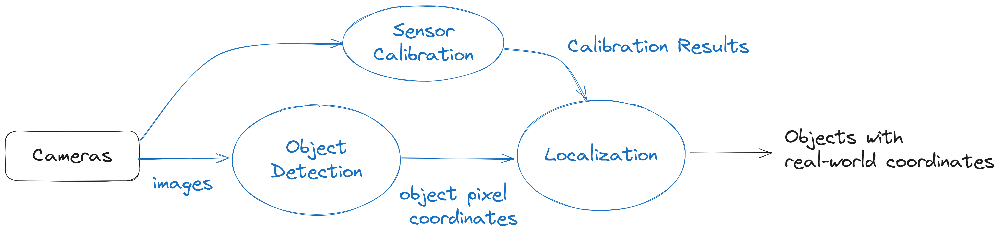

# 📷 MSight 2D Detection Pipeline

## 🧭 Overview

The MSight **2D Detection Pipeline** transforms raw camera images into **real‑world, geo‑referenced object positions** that downstream modules can use for tracking, prediction, and cooperative perception. The full pipeline includes three tightly connected components:

* **Object Detection** → detect vehicles, pedestrians, cyclists in pixel coordinates
* **Sensor Calibration** → compute mapping between the image and real-world coordinates
* **Localization** → map 2D detections into global world coordinates (e.g., UTM or local ENU)

The following diagram illustrates the high‑level workflow:

{ width="100%" }

In the next sections, we introduce how to perform each stage of the pipeline—including data labeling, detection model training, calibration workflow, and localization—and provide an example script that ties everything together.

---

## 🧠 Detection Model

To prepare a **2D detection model** for MSight, you will need to bring your **own labeled dataset**. MSight does not ship with site‑specific labels; instead, it provides a flexible interface that can work with multiple detectors. In practice, we **recommend YOLO‑family detectors** (via Ultralytics) because they are fast, well‑supported, and easy to train.

!!! tip
    You are not limited to YOLO. Any detector can be integrated into MSight as long as it subclasses `ImageDetector2DBase` and returns a `DetectionResult2D` containing a list of `DetectedObject2D` instances. See **Using Your Own Detector Section**

### ✏️ Data Labeling

If you want to use Ultralytics YOLO, then you can follow [**Ultralytics YOLO annotation format**](https://docs.ultralytics.com/datasets/detect/#ultralytics-yolo-format) to prepare 2D detection datasets. Each label file corresponds to a single image and contains one line per object:

```text
<class_id> <x_center> <y_center> <width> <height>
```

All values are **normalized** to `[0, 1]` with respect to image width and height.

However, MSight is **bottom-center focused**: for vehicles, we care most about the point where the vehicle touches the road (the projection of the center of the vehicle onto the ground plane). To make the detector learn this point better, the **"center"** of the bounding box should be the **bottom center of the vehicle**, not its geometric center.

Practically, when labeling:

* Draw the bounding box so that the **bottom edge** touches the contact point between the tires and the road.
* Adjust the box so that the **horizontal center** aligns with the **longitudinal center** of the vehicle.
* The resulting bounding box will look shorter than usual.

{ width="100%" }

This way, when YOLO uses `(x_center, y_center)` for regression, the network learns to predict the **ground-contact point** of each vehicle, which is crucial for accurate localization.

---

### 🧪 Training the 2D Detector

You can integrate **any 2D detector** into MSight, but we provide **YOLO-based detectors out of the box** using the [Ultralytics](https://docs.ultralytics.com/modes/train/) ecosystem.

#### 1. Prepare the Dataset

Organize your dataset in the standard Ultralytics structure, for example:

```text
msight_det2d_dataset/
├─ images/
│  ├─ train/
│  └─ val/
└─ labels/
   ├─ train/
   └─ val/
```

Create a YAML config (e.g., `msight_det2d.yaml`):

```yaml
path: msight_det2d_dataset
train: images/train
val: images/val

names:
  0: vehicle
  1: pedestrian
  2: cyclist
```

#### 2. Train with Ultralytics YOLO

Refer to the official [**Ultralytics YOLO training documentation**](https://docs.ultralytics.com/modes/train/) for all available options (batch size, image size, augmentation, etc.). At a high level, training looks like this:

```bash
yolo detect train \
  data=msight_det2d.yaml \
  model=yolov8m.pt \
  epochs=50 \
  imgsz=1280 \
  project=msight_det2d \
  name=exp_bottom_center
```

After training, you will obtain a weights file (for example):

```text
msight_det2d/exp_bottom_center/weights/best.pt
```

You will use this **trained checkpoint path** later in the MSight detection + localization script.

---

### ⚙️ Inference with YOLO in MSight

During inference, MSight wraps the trained YOLO model in a `YoloDetector` class that conforms to the `ImageDetector2DBase` interface and returns `DetectionResult2D`. At a high level, the logic is:

1. Load the trained YOLO checkpoint.
2. Run inference on each input frame.
3. Convert YOLO outputs (boxes, scores, class IDs) into `DetectedObject2D` instances.
4. Package them into a `DetectionResult2D` with timestamp, sensor ID, and frame ID.

The full end‑to‑end script is shown in the **Example: Detection + Localization Script** section below; here we focus on how to implement your own detector.

---

### 🧩 Using Your Own Detector

To plug in a **custom detector**, you only need to:

1. Use `DetectedObject2D` to represent each detection.
2. Wrap them into a `DetectionResult2D`.
3. Implement a subclass of `ImageDetector2DBase` with a `detect(image)` (or extended) method that returns `DetectionResult2D`.

A simplified version of the core classes looks like this:

A YOLO‑based implementation looks like this:

```python
class YourOwnDetector(ImageDetector2DBase):
    """Example of integrating a custom 2D detector into MSight."""

    def __init__(self, model_path: Path):
        super().__init__()

        # TODO: replace this with your actual model loading code.
        # For example:
        #   self.model = torch.jit.load(self.model_path).to(self.device)
        #   self.model.eval()
        self.model = self._load_model_stub()

    def _load_model_stub(self):
        """Placeholder model loader.

        Replace this with your own model backend (PyTorch, ONNXRuntime, TensorRT, etc.).
        """
        return None

    def _run_inference(self, image: np.ndarray):
        """Run your custom model and return raw detections.

        You should replace this with code that calls your model and returns
        arrays for bounding boxes, scores, and class IDs.

        Expected shapes:
        - boxes: (N, 4) in [x1, y1, x2, y2] pixel coordinates
        - scores: (N,)
        - class_ids: (N,)
        """
        # --- Dummy implementation, replace with real inference ---
        boxes = np.zeros((0, 4), dtype=float)
        scores = np.zeros((0,), dtype=float)
        class_ids = np.zeros((0,), dtype=int)
        return boxes, scores, class_ids

    def detect(
        self,
        image: np.ndarray,
        timestamp: int,
        sensor_id: str,
        sensor_type: str,
        frame_id: str,
    ) -> DetectionResult2D:
        """Run detection on a single frame and return DetectionResult2D."""
        boxes, scores, class_ids = self._run_inference(image)

        detected_objects: list[DetectedObject2D] = []
        for box, score, cls_id in zip(boxes, scores, class_ids):

            x1, y1, x2, y2 = box
            # Here we use bottom-center as the reference point for localization
            center_x = float((x1 + x2) / 2)
            center_y = float(y2)

            detected_objects.append(
                DetectedObject2D(
                    box=[float(x1), float(y1), float(x2), float(y2)],
                    class_id=int(cls_id),
                    score=float(score),
                    pixel_bottom_center=[center_x, center_y],
                )
            )

        return DetectionResult2D(
            detected_objects,
            timestamp,
            sensor_id,
            sensor_type,
            frame_id,
        )
```

You can follow the same pattern to wrap **any other detector** (e.g., Detectron2, MMDetection, custom PyTorch models) as long as it returns a `DetectionResult2D` that MSight can consume.

---

## 🎯 Calibration

MSight provides tools to **calibrate cameras against satellite maps** so that 2D detections can be accurately mapped into world coordinates.

We provide a web-based calibration tool:

**Calibration website:** [https://map2picturecalibration.net/](https://map2picturecalibration.net/)

On this website:

* The **right-hand side** shows the **uploaded sample camera image**.
* The **left-hand side** shows the corresponding **online map view (Google Maps)**.
* When you click **"Add"**, the tool places a new marker **on both sides simultaneously**.
* For each marker, adjust the position **in both views** so that they correspond to the **same physical landmark** (e.g., a lane marking, crosswalk corner, stop bar).

!!! tip
    The calibration is a **plane-to-plane transformation** between the road surface in the image and the road surface in the map. To keep this assumption valid, always select **landmarks on the road plane** (lane markings, stop bars, crosswalk corners, etc.), **not objects with significantly different height** (e.g., traffic signal heads, building corners, overpasses).

After labeling several points (we recommend **around 10 well-distributed points per sample image**), the tool exports a JSON file similar to:

```json
{
  "settings": {
    "counter": 11
  },
  "results": [
    {
      "x": 437,
      "y": 630,
      "lat": 42.30258701915996,
      "lng": -83.70413605519067,
      "id": "0"
    },
    {
      "x": 701,
      "y": 330,
      "lat": 42.30246501757532,
      "lng": -83.70416153617631,
      "id": "1"
    }
  ]
}
```

Each entry in `results` describes a **pixel ↔ world mapping pair**:

* `(x, y)` – pixel coordinates in the sample image
* `(lat, lng)` – corresponding latitude and longitude for that pixel

You can then feed this JSON file into the MSight calibration tool:
[**https://github.com/michigan-traffic-lab/camera_calibration2**](https://github.com/michigan-traffic-lab/camera_calibration2)

### Fisheye Camera Calibration

For fisheye cameras, use:

```bash
python build_pixel2world_map_minimal_example.py \
  -i calibrationResults.json \
  --intrinsic-parameters-path intrinsic.json \
  --fisheye \
  --sample-image sample_image.jpg \
  -o calibration_results.npz
```

* `sample_image.jpg` is used **only for visualizing** the calibration.
* `intrinsic.json` contains minimal intrinsic parameters, for example:

```json
{
  "f": 320,
  "x0": 645,
  "y0": 473
}
```

Here, `x0` and `y0` are the **pixel coordinates of the fisheye center** (the center of the circle), and `f` is the focal length in pixels.

### Pinhole Camera Calibration

For standard pinhole cameras, you can directly specify image size:

```bash
python build_pixel2world_map_minimal_example.py \
  -i calibrationResults.json \
  --width [image-width] \
  --height [image-height] \
  -o calibration_results.npz
```

After this step, you will obtain a **calibration result file** (e.g., `calibration_results.npz`) that maps pixel coordinates to world coordinates.

---

## 🧪 Example: Detection + Localization Script

Once you have:

1. A **trained YOLO detector** (from the training step), and
2. A **calibration result ********************`.npz`******************** file** (from the calibration step),

you can run a simple script that performs **2D detection + localization** on incoming images.

Below is a simplified example using MSight components (YOLO detector, localization maps, and a generic image retriever):

```python
import time
import copy
from pathlib import Path
import numpy as np
import cv2
import math

from msight_det2d import YoloDetector, HashLocalizer

def is_valid_number(x):
    return isinstance(x, (int, float)) and math.isfinite(x)

def load_locmaps(loc_maps_path):
    """
    Load localization maps from the specified path.
    :param loc_maps_path: path to the localization maps in the config file
    :return: localization maps
    """
    result = np.load(loc_maps_path)
    return result

# ----------------------------------------------------------------------
# Configuration
# ----------------------------------------------------------------------
config = {
    "model_config": {
        "ckpt_path": "your-ckpt-path",
        "confthre": 0.4,
        "nmsthre": 0.5,
        "class_agnostic_nms": False,
    },
    # Path to the npz file generated by camera_calibration2
    "loc_maps": "your-loc-map.npz",
    # Directory that contains input images
    "image_dir": "your-image-folder",
}

device = "cuda"  # or "cpu"
sensor_name = "camera_0"
sensor_type = "fisheye"  # or "pinhole" depending on your setup

# ----------------------------------------------------------------------
# Initialize detector
# ----------------------------------------------------------------------
model_path = config["model_config"]["ckpt_path"]
confthre = config["model_config"]["confthre"]
nmsthre = config["model_config"]["nmsthre"]
class_agnostic_nms = config["model_config"]["class_agnostic_nms"]

detector = YoloDetector(
    model_path=Path(model_path),
    device=device,
    confthre=confthre,
    nmsthre=nmsthre,
    fp16=False,
    class_agnostic_nms=class_agnostic_nms,
)

# ----------------------------------------------------------------------
# Initialize localizer (single camera)
# ----------------------------------------------------------------------
loc_maps_path = config["loc_maps"]
loc_map = load_locmaps(loc_maps_path)

# Assume loc_maps is a dict-like object; we just take the first entry
localizer = HashLocalizer(loc_map["x_map"], loc_map["y_map"])

# ----------------------------------------------------------------------
# Build list of image paths
# ----------------------------------------------------------------------
image_dir = Path(config["image_dir"])
image_paths = sorted(
    [p for p in image_dir.glob("*.jpg")] +
    [p for p in image_dir.glob("*.png")] +
    [p for p in image_dir.glob("*.jpeg")]
)

if not image_paths:
    print(f"No images found in {image_dir}.")
else:
    print(f"Found {len(image_paths)} images in {image_dir}.")

# ----------------------------------------------------------------------
# Loop over images: detect + localize
# ----------------------------------------------------------------------
for img_path in image_paths:
    print(f"\nProcessing {img_path} ...")

    img = cv2.imread(str(img_path))
    if img is None:
        print(f"Failed to read image: {img_path}")
        continue

    # You can use any timestamp / frame_id scheme you like
    timestamp = int(time.time() * 1000)  # ms since epoch (example)
    frame_id = img_path.stem

    # --------------------------------------------------------------
    # Detection
    # --------------------------------------------------------------
    start = time.perf_counter()

    detection_result = detector.detect(
        img,
        timestamp=timestamp,
        sensor_id=sensor_name,
        sensor_type=sensor_type,
        frame_id=frame_id,
    )

    end = time.perf_counter()
    print(
        f"Detection time for {img_path.name}: "
        f"{end - start:.4f}s, "
        f"{len(detection_result.object_list)} raw objects"
    )

    # --------------------------------------------------------------
    # Localization
    # --------------------------------------------------------------
    start = time.perf_counter()

    # Localize all detections for this single camera
    localizer.localize(detection_result)

    # Remove objects without valid lat/lon
    for obj in copy.copy(detection_result.object_list):
        if not (is_valid_number(obj.lat) and is_valid_number(obj.lon)):
            detection_result.object_list.remove(obj)

    end = time.perf_counter()
    print(
        f"Localization time: {end - start:.4f}s, "
        f"{len(detection_result.object_list)} localized objects"
    )

    # At this point, detection_result.object_list contains objects
    # with lat / lon / x / y fields filled in (for valid ones).
    # You can save them to a file, send to MSight pipeline, etc.

```

This script demonstrates the **core logic**:

1. Retrieve images from your source.
2. Run YOLO-based detection.
3. Use calibration maps to localize detections into world coordinates.
4. Filter out invalid localization results.

You can then feed the localized objects into downstream MSight modules for **tracking, prediction, and near-miss detection**.
