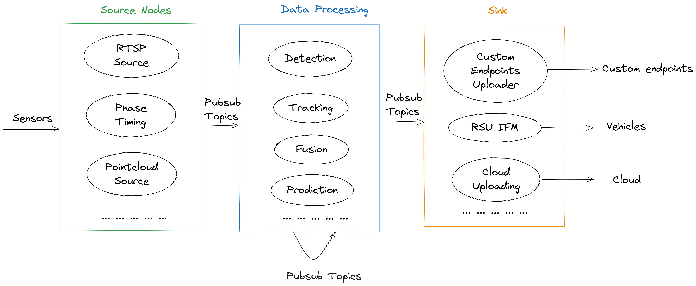

# System Architecture

**MSight** is designed to run on an **edge device** that shares the same network with roadside sensors and other infrastructure devices.  

---

## 🧩 System Overview

The system is built on a **distributed node architecture**, where each node can operate independently.  
This design ensures **flexibility**, **fault tolerance**, and **scalability**, allowing the edge portion of MSight to handle multiple processing tasks in parallel.

Nodes communicate with each other through a **robust publish/subscribe (pub/sub)** system, enabling:

- Low-latency message exchange between nodes  
- Efficient resource usage on edge devices  
- Decoupled communication (nodes can be added or removed dynamically)

{ width="100%" }

---

## ⚙️ Key Advantages of the Edge Architecture

### 1. Field-Friendly Deployment
One of MSight’s major advantages is its **ease of use for deployment in the field**.  
End users and technicians **do not need to understand** the internal pub/sub messaging system.  
MSight packages its functionalities into **self-contained executable nodes**, each performing an atomic task (e.g., detection, fusion, communication).

This allows field personnel to:

- Deploy and manage functionalities without writing Python code  
- Quickly start or stop modules as needed  
- Configure nodes through simple YAML configuration files

---

### 2. Developer-Friendly Modularity
For developers and engineers integrating **new sensors** or **custom algorithms**, MSight provides a clean interface to plug into the existing architecture.

Each custom node:

- Focuses only on one component (e.g., a perception algorithm, a streaming protocol)  
- Can be registered into the node graph easily  
- Communicates seamlessly with other nodes through Redis Pub/Sub

This modular design **reduces complexity**, **encourages reusability**, and **accelerates innovation**.

---

### 3. Hardware Considerations
For optimal performance, it is recommended to use an edge machine with sufficient **CPU**, **GPU**, **memory resources** and **hardware storage**.  
This is typically the case for **roadside edge devices** such as those installed in intelligent intersections.

---

## 🧠 Core Design Concept

The **MSight Edge Library** provides a **suite of executable nodes** that can be combined to build complex applications.  
Each node operates independently, enabling flexible system composition for different use cases.

The figure above illustrates the main design concept of how **source**, **processing**, and **sink** nodes interact.

---

## 🧱 Node Types

MSight offers three main categories of nodes, each representing a stage in the data pipeline:

### 🔹 Source Nodes
Responsible for acquiring data from input sources such as sensors, files, or network streams.  
They receive raw data and publish them into standardized formats so that downstream nodes can process them consistently.

Examples:

- Camera or LiDAR readers  
- Traffic signal phase and timing information from traffic signal controller

---

### 🔹 Data Processing Nodes
Handle the transformation and interpretation of data received from source nodes.  
Typical tasks include:
- Filtering or preprocessing  
- Object detection and tracking  
- Data fusion or trajectory prediction  

These nodes prepare processed data for subsequent analysis or output.

---

### 🔹 Sink Nodes
Consume data from processing nodes and perform output operations, such as:

- Displaying or visualizing results  
- Saving to local or cloud storage  
- Publishing to web services or V2X communication channels  

Sink nodes are typically the last stage in a processing pipeline.

---

## 📚 Summary

MSight’s architecture combines **distributed modularity**, **real-time edge computing**, and **developer extensibility**.  
This design makes it equally effective for:

- Real-time field deployment  
- Scalable multi-node edge clusters  
- Research and development of new perception or prediction algorithms  

Together, these features make MSight a flexible foundation for **intelligent roadside infrastructure** and **cooperative perception systems**.

- [Nodes](nodes.md)
- [Pubsub system](pubsub.md)
- [Data](data.md)
