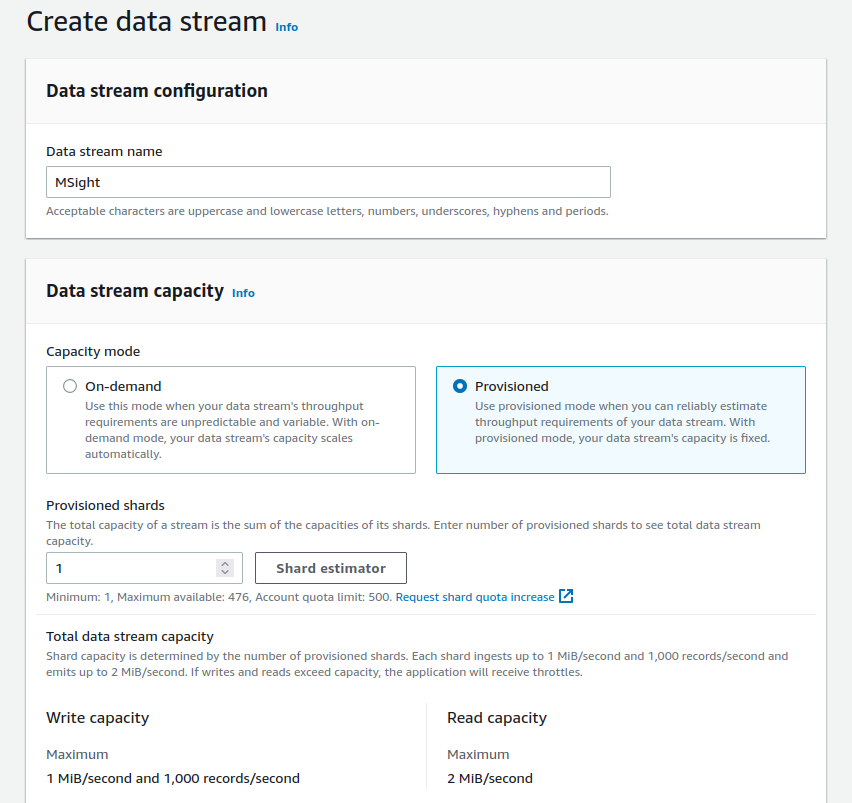
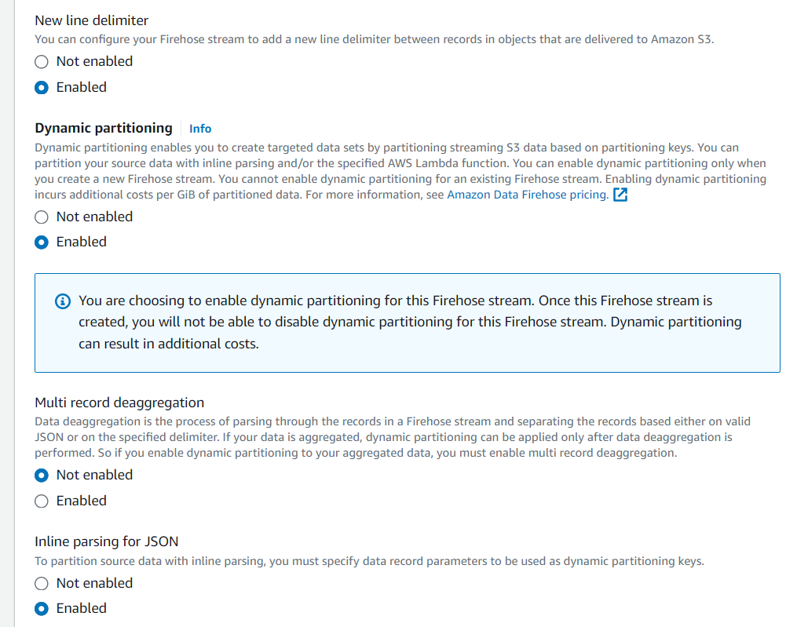

# ☁️ Cloud Setup: Core Functionalities with AWS Kinesis, Firehose and S3

MSight integrates tightly with AWS to provide reliable, scalable data ingestion from roadside edge devices.
This section walks you through the **minimal cloud setup** needed to enable MSight’s core functionalities.

Once completed, your MSight deployment will be ready to **receive, store, and organize** real-time data from edge devices.

---

# 🗂️ 1. Set Up Data Accommodation

MSight uses:

* **AWS Kinesis Data Streams** to receive real-time data from the edge
* **AWS Kinesis Firehose** to deliver processed data into
* **AWS S3** for long-term storage and organization

The steps below guide you through configuring these three components.

---

## 📦 Step 1 — Create an S3 Bucket

MSight stores all streamed data in Amazon S3.

1. Go to the **AWS S3 Console:**
   [https://console.aws.amazon.com/s3](https://console.aws.amazon.com/s3)
2. Click **“Create bucket”**
3. Enter a bucket name (e.g., `msight-data-yourcity`)
4. Leave all settings as default (unless you have a specific compliance requirement)
5. Scroll down and click **“Create bucket”**

That’s it — your storage layer is ready.

---

## 🔄 Step 2 — Create a Kinesis Data Stream

The Data Stream receives messages from MSight Edge, including sensor outputs and metadata.

1. Open the **AWS Kinesis Console:**
   [https://console.aws.amazon.com/kinesis](https://console.aws.amazon.com/kinesis)
2. Click **“Create data stream”**
3. Enter a **stream name**
4. Under **Capacity mode**, choose:
   **Provisioned**

{ width="100%" }

### 📏 How many shards do I need?

Kinesis assigns **1 MiB/sec** per shard.
Each sensor consumes bandwidth according to its data rate.

Use this guideline:

> **One shard per 1 MiB/sec of data per sensor**

#### Example

If you have **4 sensors**, each producing **1.6 MiB/sec**:

* Each sensor needs **2 shards**
* Total shards = **4 × 2 = 8**

!!! note
    To estimate your exact shard requirement, expand the "Example record" section in AWS Kinesis to see your sensor’s expected data output.

---

## 🔥 Step 3 — Configure Kinesis Firehose (Data Delivery Stream)

Firehose moves data from Kinesis → S3, applying dynamic partitioning so your data lands in the correct folder structure.

1. Go to **Kinesis → Delivery Streams**
2. Click **“Create delivery stream”**
3. For **Source**, select:
   **Kinesis Data Stream**
4. For **Destination**, select:
   **Amazon S3**
5. Choose the Data Stream and S3 Bucket you created above

---

### 📂 Enable Dynamic Partitioning

To ensure MSight stores data cleanly organized:

1. Enable **Dynamic Partitioning**
2. Enable:

   * **New line delimiter**
   * **Inline parsing for JSON**

Your screen should look similar to this:



---

### 🔑 Create Partition Keys

Add dynamic partitions in the Firehose configuration:

* `year`
* `month`
* `day`
* `hour`
* `sensor_name` → using JSON path:

  ```
  .sensor_name
  ```

Firehose will extract these values from incoming JSON records.

---

### 📁 S3 Prefix Format

Use the following prefix to organize data per device, per sensor, per date:

```text
!{partitionKeyFromQuery:device_name}/!{partitionKeyFromQuery:sensor_name}/!{partitionKeyFromQuery:year}-!{partitionKeyFromQuery:month}-!{partitionKeyFromQuery:day}/!{partitionKeyFromQuery:hour}/
```

We recommend setting:

* Error prefix:

  ```
  error/
  ```

This ensures misformatted records are sent to an “error/” folder instead of being silently dropped.


---

# 🎉 Setup Complete!

Your cloud infrastructure is now fully configured to:

* Ingest data from MSight Edge
* Organize data by device, sensor, and timestamp
* Store all raw sensor outputs in S3
* Automatically handle partitioning and JSON extraction

Your MSight system is now ready to run with its **core functionality** enabled.

