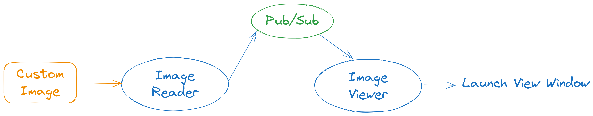

# Quick Start Tutorial

This quick tutorial walks you through running your first **MSight** nodes on a single machine.  
It works on **Windows**, **Linux**, or **macOS**. You can see the [tutorial folder with all resource in it](https://github.com/michigan-traffic-lab/MSight_tutorials/tree/main/two_nodes).

---

## 🧰 Step 1. Install MSight Locally

Follow the [Pip Installation](../installation/pip.md) guide to install MSight on your machine.  

---

## 🧱 Step 2. Set Up a Redis Server

MSight uses **Redis Pub/Sub** for communication and configuration.  
You need to have a Redis server running locally or accessible in your network.

### Option A — Install Redis Natively
You can install Redis directly on your system by following the official guide:  
👉 [https://redis.io/docs/latest/operate/oss_and_stack/install/install-redis/](https://redis.io/docs/latest/operate/oss_and_stack/install/install-redis/)

After installation, start the Redis server:
```bash
redis-server
```

---

### Option B — Run Redis via Docker
If you have [Docker](https://www.docker.com/) installed, you can start a Redis container easily:

```bash
docker run -d   --name redis-server   -p 6379:6379   redis:latest
```

---

## ⚙️ Step 3. Set Environment Variable

Set the environment variable **MSIGHT_EDGE_DEVICE_NAME** to identify your device.  
For this tutorial, we’ll use `testing`.

### On Linux/macOS:
```bash
export MSIGHT_EDGE_DEVICE_NAME=testing
```

### On Windows (PowerShell):
```cmd
set MSIGHT_EDGE_DEVICE_NAME=testing
```

> 💡 In deployment, replace `testing` with the actual device name (e.g., `intersection_mcity_north`).

---

## ✅ Step 4. Check MSight Status

Verify that your environment and Redis connection are working:

```bash
msight_status
```

If everything is set up correctly, you should see a table like this:

```
--------------------------NODES--------------------------
+-------------+-----------------+-------------------+--------+------------------+----------+
| Node Name   | Publish Topic   | Subscribe Topic   | Type   | Last Heartbeat   | Status   |
+=============+=================+===================+========+==================+==========+
+-------------+-----------------+-------------------+--------+------------------+----------+
```

If you see this table (even empty), 🎉 **you’re ready to launch nodes!**

---

## 🧩 Step 5. Launch Two Simple Nodes

In this example, we’ll create **two nodes**:

1. A **source node** that reads an image and publishes it.  
2. A **viewer node** that subscribes to the same topic and displays the image.

*(Illustration: two nodes connected through Redis Pub/Sub)*  
{ width="100%" }

---

### 🖼️ Prepare the Folder

1. Create a new folder anywhere on your system.  
2. Place your favorite `.jpg` image inside it (e.g., `myphoto.jpg`).

---

### 🚀 Launch the Source Node

Navigate to that folder in your console, start the **local image source node**:

```bash
msight_launch_local_image   -n test_local   -pt local   --sensor-name local_image   -p myphoto.jpg
```

Explanation:

- `-n` : node name (`test_local`) — must be unique across the system  
- `-pt` : publishing topic name (`local`) — subscribers must use the same topic to receive messages  
- `--sensor-name` : identifies which sensor this data came from  
- `-p` : path to the image file  

If successful, you’ll see something like:
```
Starting the dummy local image source node test_local.
```

---

### 👀 Launch the Viewer Node

Open a new terminal window and start the viewer node:

```bash
msight_launch_image_viewer -n image_viewer -st local
```

Since both nodes share the same topic (`local`), the viewer will receive and display the image.

If everything works, a window will open showing your image 🎉  
You’ve just built a simple data pipeline — one node publishes, the other subscribes and visualizes.

---

### 🖼️ Check Current Status

You can check the status of your nodes at any time using:

```bash
msight_status
```

You should see something like this:
```
--------------------------NODES--------------------------
+--------------+-----------------+-------------------+----------------------+---------------------+----------+
| Node Name    | Publish Topic   | Subscribe Topic   | Type                 | Last Heartbeat      | Status   |
+==============+=================+===================+======================+=====================+==========+
| image_viewer |                 | local             | ImageViewerSinkNode  | 2025-12-13 21:36:03 | RUNNING  |
+--------------+-----------------+-------------------+----------------------+---------------------+----------+
| test_local   | local           |                   | LocalImageSourceNode | 2025-12-13 21:36:03 | RUNNING  |
+--------------+-----------------+-------------------+----------------------+---------------------+----------+
--------------------------TOPICS--------------------------
+--------------+----------------------------------+---------------+
| Topic Name   | Data Type                        | Description   |
+==============+==================================+===============+
| local        | msight_core.data.image.ImageData |               |
+--------------+----------------------------------+---------------+
```
Which shows both nodes are running and communicating! 🎉
## 💡 What You Learned

You now understand:
- How MSight nodes communicate through **Pub/Sub topics**  
- How to set up and verify your environment  
- How to launch a simple **source → sink** data flow  

This is the foundation for building complex MSight pipelines.

---

## 📚 Continue Exploring

Try these extended tutorials next:

- [Receiving Data from RTSP Source and Push to Cloud](../tutorials/data-streaming-pipeline.md)  
- [Full Object Detection Pipeline with Roadside Camera](xxx.md)
