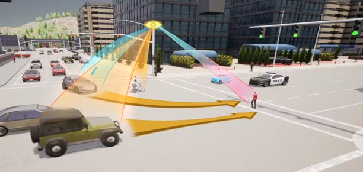

# MSight Roadside Intelligence System

## 🌐 What is MSight?

**MSight** is an **edge-cloud intelligent infrastructure system** developed by the  **Mcity** and the **Michigan Mobility Transformation Lab (MTL)** of University of Michigan.  
It enables next-generation *roadside intelligence* by tightly integrating with intersection facilities such as:

- Roadside sensors (cameras, LiDAR, radar)
- Traffic signal controllers and cabinets
- V2X roadside units (RSUs)
- Edge compute boxes and cloud services

MSight comes with **state-of-the-art roadside perception, sensor fusion, trajectory prediction and nearmiss detection algorithms**, providing a unified platform for perception, communication, and prediction across diverse roadside environments.

{ width="100%" }

---

## ⚙️ What Can MSight Do?

The **MSight System** is a **general-purpose, modular edge–cloud framework** designed to be highly customizable and support a wide range of roadside and cooperative-perception applications connecting roadside and vehicle systems.  
It can, in theory, power *any* infrastructure-based intelligent transportation application.  
Some representative use cases include:

- 🛰️ **Roadside Sensor Data Streaming**  
  Stream multi-modal sensor data (video, LiDAR, radar, etc.) in real time with low latency to interested edge or cloud services.

- 🚗 **Roadside Object Detection**  
  Perform on-device or edge-based detection of vehicles, pedestrians, and other road users.

- 🤝 **Cooperative Perception (CP)**  
  Fuse and share detection results via RSU using standardized formats such as **SAE J3224 SDSM**, extending vehicle awareness beyond line of sight.

- ⚠️ **Near-Miss and Crash Detection**  
  Continuously monitor and analyze interactions between road users to identify near-miss or crash-prone events in real time.

- 🧠 **Proactive Safety and Hazard Prediction**  
  Predict hazardous situations (e.g., potential collisions) in advance and send timely warnings to vehicles through V2X communication to prevent accidents.

- 🚦 **Traffic Signal Violation Detection**  
  Detect red-light violations by analyzing vehicle trajectories in relation to signal phase and timing data.

- 🔍 **And More…**  
  Thanks to its modular and extensible design, MSight can host custom analytics, data management, or AI modules for future roadside applications.

---

## 📚 Learn More

Explore the documentation using the left navigation panel or top tabs:

- [Installation](installation/index.md)
- [Quick Start](getting-started/quickstart.md)
- [System Architecture](architecture/index.md)
- [Deployments](deployment/index.md)
- [Tutorials](tutorials/index.md)
- [Cloud Integration](cloud-integration/index.md)
- [Mobile Client Library](mobile/index.md)
- [Developer Guide](developer-guide/index.md)
- [API Reference](api/index.md)  

---

*© University of Michigan — Mcity & Michigan Mobility Transformation Lab*
