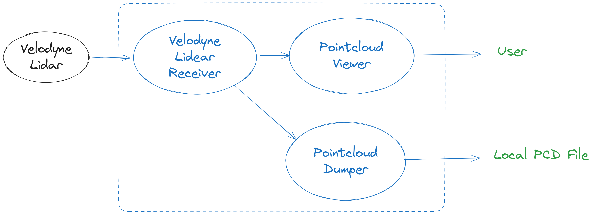

# 📡 Receiving Point Clouds from Velodyne LiDAR with MSight

MSight offers built‑in support for **Velodyne LiDAR** sensors, enabling real‑time point cloud streaming, visualization, and storage directly on an edge device. This tutorial guides you through the steps to:

* Receive point cloud data using MSight
* Visualize the point cloud
* Save data locally for analysis

The example below uses a **Velodyne VLP‑32C**, but other models from Velodyne are also supported by MSight.

In this tutorial, we will setup a receiving node to receive pointcloud data from the lidar, a viewer node to view the pointcloud data, and a local dumper to dump pointcloud to local, as shown in this image:

{ width="100%" }
---

## 📌 Prerequisites

Before starting, you will need:

* A **Velodyne LiDAR** device (e.g., VLP‑32C)
* A **networked MSight edge device** (same LAN as LiDAR)
* Correct data/telemetry port configuration, the default setting of Velodyne lidar is:

| Function              | Default Port | Notes                                |
| --------------------- | ------------ | ------------------------------------ |
| LiDAR UDP data stream | `2368`       | Contains point cloud packets         |
| Telemetry info        | `8308`       | Contains sensor status + calibration |

> If you configure the LiDAR to use different ports, adjust the command parameters accordingly.

Ensure the LiDAR is properly configured to **send UDP packets** to the **edge device's IP address**.

---

## 🚀 Step 1 — Launch the LiDAR Receiver Node

This node listens for UDP packets and converts them into MSight point cloud messages.

Run:

```bash
msight_launch_velodyne_lidar \
  --port 2368 \
  --telemetry-port 8308 \
  -pt lidar-topic \
  -n msight-lidar-1 \
  --sensor-name velodyne_1 \
  --model-id VLP32C
```

### 🔍 What do these parameters mean?

| Argument                   | Meaning                                                |
| -------------------------- | ------------------------------------------------------ |
| `--port`                   | UDP input port for point cloud packets                 |
| `--telemetry-port`         | UDP port for LiDAR calibration + health info           |
| `-pt lidar-topic`          | Publishes decoded point cloud into topic `lidar-topic` |
| `-n msight-lidar-1`        | Node name (unique identifier)                          |
| `--sensor-name velodyne_1` | Sensor identifier (used for filtering downstream)      |
| `--model-id VLP32C`        | Selects Velodyne model for packet decoding             |

!!! tip 
 
    You can run `msight_launch_velodyne_lidar --help` to view the **full list of supported Velodyne model IDs**. Use `--model-id YOUR_MODEL_ID` to match your specific LiDAR device.

✔️ If everything is working, MSight will start receiving and decoding point clouds.

---

## 👀 Step 2 — Visualize the Point Cloud

To verify that receiver node is running properly, you can open a 3D viewer node that subscribes to the published LiDAR data:

```bash
msight_launch_pointcloud_viewer \
  -n pcviewer \
  -st lidar-topic \
  --filter-sensor-name velodyne_1
```

This node:

* Subscribes to topic `lidar-topic`
* Filters only point clouds from sensor `velodyne_1`
* Displays a live viewer window for real‑time monitoring

> Useful for sensor testing, calibration validation, and field deployment checks.

---

## 💾 Step 3 — Save Point Clouds Locally

You can record the streamed data for offline processing:

```bash
msight_launch_pointcloud_local_dumper \
  -st lidar-topic \
  --output-folder-path /your/path \
  --name pc_dumper
```

This node:

* Listens for point clouds on topic `lidar-topic`
* Saves each frame into `.pcd` files
* Organizes results by timestamp

> Replace `/your/path` with any writable directory on your edge system.

---

## 🧠 Summary

Running these three nodes forms a complete LiDAR data flow:

```
Velodyne LiDAR → Receiver Node → Viewer / Dumper → Local / Cloud Analytics
```

This workflow enables:

* Real‑time perception debugging
* Dataset creation
* Easy integration into advanced MSight pipelines

